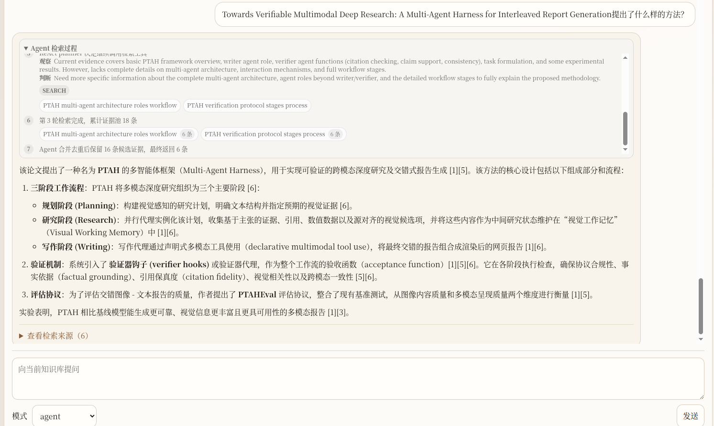

# ResearchMind

ResearchMind 是一个面向科研阅读的本地论文知识库工作台。它把论文搜索、结果筛选、PDF 入库、RAG 检索和带引用问答串成一条完整流程，目标是把论文从“查到”推进到“可检索、可问答、可追溯”。

## 演示


## 产品定位

ResearchMind 由两个核心工作区组成：

- **Brief**：围绕一个主题发起论文搜索，保存候选论文和 rerun 结果，用于探索和筛选。
- **Knowledge Base**：将筛选后的论文沉淀为知识库，后台完成 PDF 下载、解析、分块、索引，并支持基于证据的问答。

典型流程：

1. 搜索论文并生成 Brief。
2. 从 Brief 中选择论文加入 Knowledge Base。
3. 系统下载 PDF、解析全文、提取图表并建立索引。
4. 用户在知识库内提问，系统返回答案和具体引用来源。

## 数据拉取与去重

论文搜索会拉取标题、作者、摘要、PDF 链接、DOI、发布时间等结构化元数据。当前主要面向 arXiv 场景，代码中保留 OpenAlex、PubMed 等来源的扩展能力。

数据侧重点：

- 支持分页拉取、时间窗口、回填和 rerun。
- 基于 source id、DOI、标题等信息去重。
- 搜索结果先进入 Brief，用户确认后再加入 Knowledge Base，减少无关论文进入长期知识库。

## RAG 能力

### PDF 解析与多模态分块

论文加入 Knowledge Base 后会进入 ingestion 流程：

- 使用 PyMuPDF 提取 PDF 逐页文本。
- 按章节和句子边界进行 section-aware chunking。
- 提取 PDF 图片，并结合页面 caption 生成 figure/table chunk。
- 可选使用 Qwen3-VL-Instruct 对图表做离线视觉理解，生成检索导向 caption。
- 为每篇论文生成 `Paper Summary` chunk，概括贡献、方法模块、实验设置和主要结论。

每个 chunk 会保留 source、source_id、页码、section、modality、image_path 等元信息，方便回答时追溯来源。

### 向量检索与索引

系统会为知识库建立多种索引：

- 文本 chunk：使用 embedding 模型生成向量表示。
- 图表 chunk：可使用 Qwen3-VL-Embedding 建立 image-vector 索引。
- 全文检索：使用 SQLite FTS5 支持关键词与 BM25 风格召回。
- 向量存储：优先使用 FAISS，不可用时退化为 numpy 索引。

### 多路融合与 Rerank

问答时会组合多条召回路径：

- dense vector retrieval
- SQLite FTS retrieval
- image-vector retrieval
- query-aware prior
- optional reranker

融合后的 top-k 证据进入回答生成。回答必须基于召回证据，并使用 `[1]`、`[2]` 形式引用具体来源。

### 引用溯源

每条回答引用会绑定：

- 论文标题
- 页码范围
- section title
- chunk 摘录
- 检索分数
- 图表图片链接（如果来自 figure/table chunk）

这使得用户可以判断回答依据是否充分，而不是只得到一段不可追溯的自然语言。

## 图像语义能力

当前系统已经接入 VL 模型，但方式是：

- 入库阶段：Qwen3-VL-Instruct 离线理解图表并生成 caption。
- 检索阶段：Qwen3-VL-Embedding 支持用文字问题召回相关图表。
- 回答阶段：基于召回到的图表 caption、图片引用和正文证据生成答案。

因此当前支持图像语义检索和图表证据引用；但还不是“提问时实时把原图送入 VLM 做视觉问答”的完整 VQA。后续 Agentic RAG 会加入关键图表的 VLM 二次验证。

## 检索模式

- **standard**：默认模式，执行向量检索、FTS、图像检索、多路融合和 rerank。
- **decompose**：轻量拆问模式，将复杂问题拆成多个子问题后检索并融合。
- **agent**：ReAct-style Agentic Search。LLM 在每轮检索后读取当前证据摘要，决定继续搜索或结束，并生成下一轮工具调用 query。

### Agentic Search 06/04/26添加

当前 `agent` 模式已经接入可解释的多轮检索流程：

- 先用原问题执行一次标准 RAG 检索。
- LLM 作为 ReAct planner 读取当前证据摘要，输出 `observation`、`rationale`、`action` 和下一轮检索 query。
- 后端执行检索工具，累计证据池并按 chunk id 去重。
- 多轮循环后合并候选证据，进入 rerank 和最终回答生成。
- 前端通过 SSE 流式显示 Agent 检索过程，包括每轮 query、召回数量、可见判断摘要和最终证据规模。

为了区分正式回答和 agent 工作过程，前端将检索轨迹放在灰色小字的小框中；内容较多时可在框内滚动浏览。这里展示的是可审计的工具调用轨迹和可见判断摘要，不展示模型隐藏思维链原文。



## 后续计划：

- 引入更完整的 AgentState 和 Tool Registry。
- 支持 citation recovery，必要时扩展相邻 chunk 补足引用。
- 对关键图表触发 VLM visual verification。
- 输出 answer audit，标注证据覆盖度、不足点和低置信度提示。

## 技术栈

- Python / FastAPI
- SQLite / SQLite FTS5
- PyMuPDF
- FAISS 或 numpy fallback
- BAAI/bge-m3
- BAAI/bge-reranker-base
- Qwen3-VL-Instruct
- Qwen3-VL-Embedding
- OpenAI-compatible LLM API

## 启动

准备 `.env`：

```bash
LLM_API_KEY=your_api_key
```

启动服务：

```bash
cd research_mind
.venv/bin/paper-tracker serve --config config/qwen.yml
```

打开：

```text
http://127.0.0.1:8000
```

## 当前边界

ResearchMind 仍是本地科研工作台原型。检索质量受 PDF 解析、embedding/reranker、图表 caption 和知识库证据覆盖度影响。`Paper Summary` chunk 能改善全文级问题，但回答仍需要原文 chunk 支撑引用与细节。

## License

MIT
